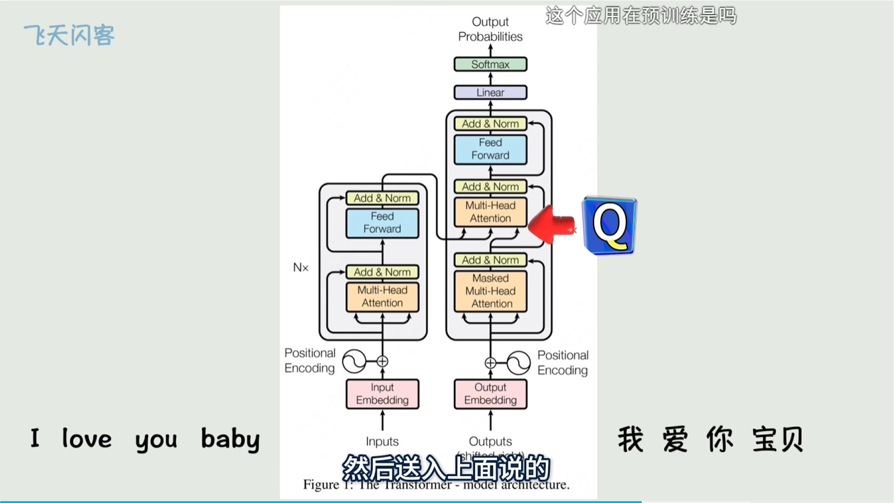
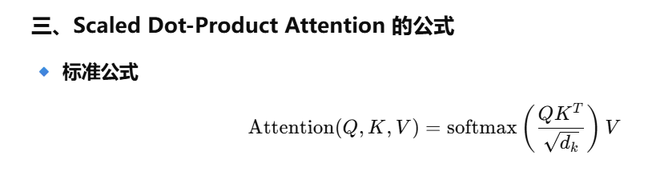
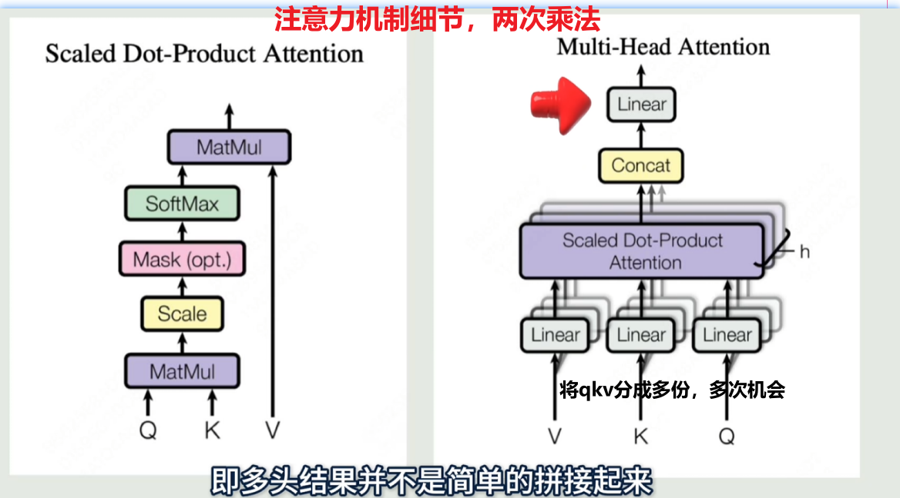

## Transformer

### Transformer基础架构

输入词向量a1，a2，a3

1. 添加位置信息，
2. 上下文信息(缩放点积注意力机制)
    ① W_q，W_k，W_v矩阵（通过训练得到）
    ② 得到相似度系数：SUM(qi · kj)，
    ③ 按相似度对vi相加，得到新a1，a2，a3

- 多头注意力，使用两组Q,K,V矩阵(两个头)，把两个新的a1,a2,a3拼接起来

掩码**逐个输出**词的概率分布

